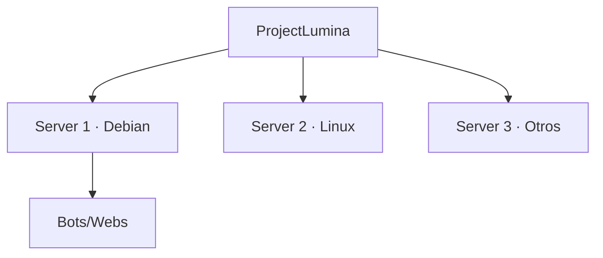
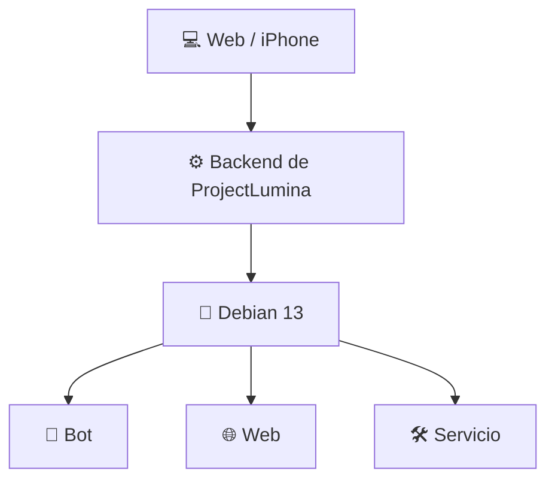
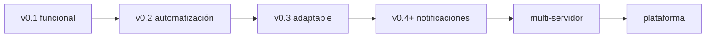

# 💡 ProjectLumina

> Plataforma personal de administración remota de servidores, bots, webs y servicios.

  

---

## 📖 Resumen

**ProjectLumina** es un centro de control remoto para administrar un servidor (laptop con **Debian 13**) desde una **interfaz web** accesible desde la laptop principal y un **iPhone**.

Con Lumina podrás, sin ir físicamente al servidor:

- 🤖 **Administrar bots**
- 🌐 **Administrar webs**
- 🔄 **Iniciar, detener y reiniciar servicios**
- 📊 **Consultar estados y métricas**
- ⚡ **Ejecutar acciones remotamente**

> 📍 **Fase actual:** planificación. Ver [Estado actual](docs/estado-actual.md).

---

## 🎯 Objetivos

| Objetivo | Descripción |
|----------|-------------|
| **Principal** | Administrar y controlar el servidor remotamente mediante una interfaz centralizada |
| **Secundario** | Aprender programación, administración de servidores y redes |
| **Inmediato** | Administrar correctamente un bot y una web desde un dashboard web |

→ Más en [Objetivos](docs/objetivos.md)

---

## 🧭 Visión

ProjectLumina evolucionará desde un MVP sencillo hacia una plataforma **automatizada** y **multi-servidor** con agentes, aplicaciones móviles y soporte para terceros.



→ Más en [Visión](docs/vision.md)

---

## 🏗️ Arquitectura del MVP



| Capa | Tecnología |
|------|------------|
| Backend | Python — Flask o FastAPI |
| Frontend | HTML, CSS, JavaScript |
| API | REST (WebSockets a futuro) |
| Base de datos | SQLite (PostgreSQL a futuro) |
| Servidor | Debian 13 · systemd |

→ Más en [Arquitectura](docs/arquitectura.md)

---

## 🗺️ Roadmap



→ Más en [Roadmap](docs/roadmap.md)

---

## 📚 Documentación

| Área | Documento |
|------|-----------|
| 📖 Inicio | [Documentación general](docs/README.md) |
| 🎯 Plan | [Requisitos](docs/requisitos.md) · [Roadmap](docs/roadmap.md) |
| 🛠️ Desarrollo | [Backend](docs/desarrollo/backend.md) · [Frontend](docs/desarrollo/frontend.md) · [API](docs/desarrollo/api.md) |
| 📊 Dashboard | [Dashboard](docs/desarrollo/dashboard.md) |
| 🤖 Bots | [Bots](docs/desarrollo/bots.md) · [Auto-restart](docs/desarrollo/auto-restart.md) |
| 🌐 Webs | [Webs](docs/desarrollo/webs.md) |
| 🐧 Servidor | [Servidor](docs/desarrollo/servidor.md) |
| 🔐 Seguridad | [Seguridad](docs/seguridad.md) |
| 📚 Investigación | [Investigación](docs/investigacion/README.md) |
| 🧠 Obsidian | [Mapa de notas](docs/obsidian/) |

---

## 🛠️ Requisitos

> En definición. Ver [Requisitos](docs/requisitos.md).

- **Python 3** (backend).
- Navegador moderno (laptop e iPhone).
- Servidor con **Debian 13** (para el despliegue real).

---

## 🚀 Inicio rápido

> ⚙️ Estado actual: **base inicial** funcional localmente con [FastAPI]. La gestión real de bots/webs se añadirá en `v0.1` cuando se disponga de acceso al servidor.

```bash
bash scripts/run.sh
```

Este único comando crea el entorno virtual (si no existe), instala las dependencias y arranca el servidor.

- **Web:** http://127.0.0.1:8000/
- **API de prueba:** http://127.0.0.1:8000/api/health → `{"status":"ok"}`

Ejecutar los tests:

```bash
.venv/bin/pytest pruebas/
```

---

## 📁 Estructura del proyecto

```
ProjectLumina/
├── config/       # Configuración
├── docs/         # Documentación
├── pruebas/      # Tests
├── scripts/      # Utilidades
├── src/          # Código fuente
└── README.md
```

Detalle completo en [Arquitectura - estructura propuesta](docs/arquitectura.md#estructura-propuesta-del-código).

---

## 🤝 Contribuir

Consulta [CONTRIBUTING.md](CONTRIBUTING.md).

---

## 📜 Licencia

[MIT](LICENSE) — Copyright (c) 2026 netsent
