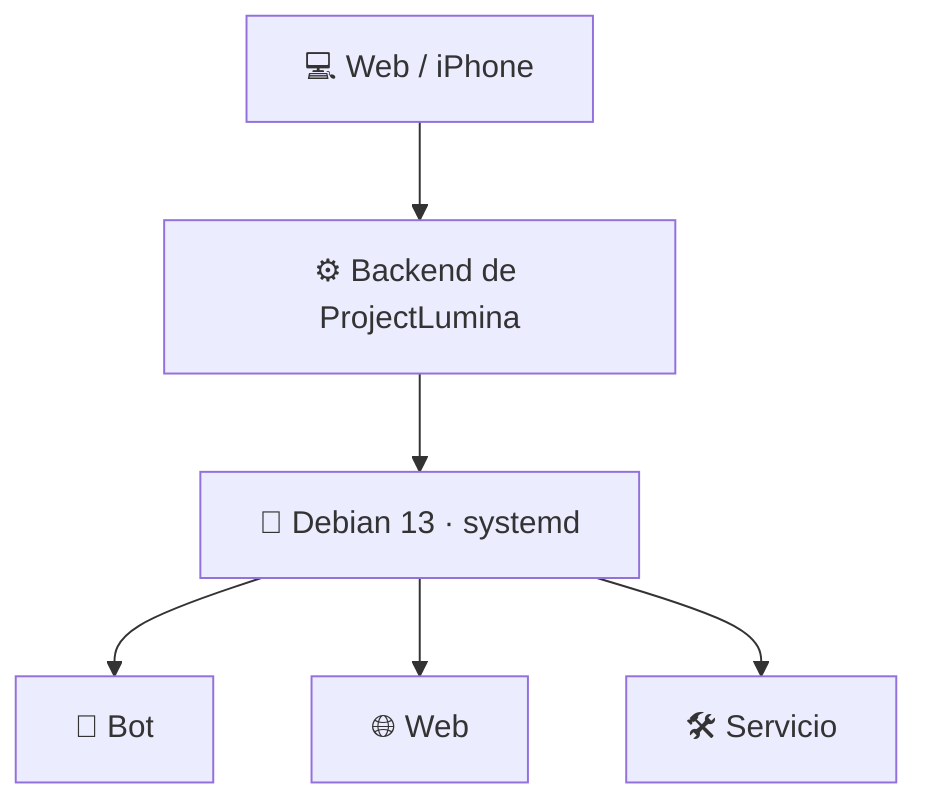
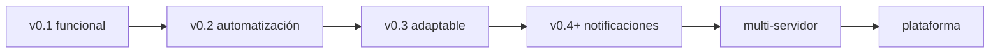

# 💡 ProjectLumina

> Panel de administración que gestiona **la máquina donde corre**: servicios systemd, bots, webs y métricas del sistema.

  

---

## 📖 Qué es

**ProjectLumina** administra el equipo donde se ejecuta (sistema operativo, servicios systemd, procesos, bots y webs) desde una interfaz web. Funciona de forma **local**; la administración remota desde otros dispositivos será una fase posterior.

Con Lumina podrás, sin entrar por consola:

- 🤖 **Administrar bots**
- 🌐 **Administrar webs**
- 🔄 **Iniciar, detener y reiniciar servicios**
- 📊 **Consultar métricas del sistema** (CPU, RAM, uptime)
- 📜 **Ver logs** en un terminal integrado
- ➕ **Registrar servicios desde la interfaz**

---

## 📍 Estado actual

| Fase | Estado |
|------|--------|
| Planificación y documentación | ✅ Completa |
| Base del proyecto (FastAPI) | ✅ Funciona localmente |
| Dashboard web | ✅ Conectado a la API real |
| Requisitos técnicos | ✅ Cerrados |
| Arquitectura definitiva del MVP | ✅ Cerrada |
| Backend v0.1 en capas (`app/`) | ✅ API REST + token + SQLite + tests |
| Registro de servicios | ✅ Desde la interfaz (modal → `POST /api/servicios`) |
| Desarrollo v0.1.0 | 🟡 En curso |
| Instalación en otros equipos | ⏳ Fase posterior |

- Ver: [Estado actual](docs/00%20-%20Inicio/Estado%20Actual.md)

> **Orientación:** ProjectLumina gestiona la máquina donde corre (local). El acceso remoto desde otros dispositivos queda para una fase posterior. La interfaz es una sola página (vistas por hash) conectada a la API v0.1: métricas, estados reales, iniciar/detener/reiniciar, logs y registro de servicios.

---

## 🧱 Stack (definitivo)

| Área | Tecnología |
|------|------------|
| Backend | Python · **FastAPI** · Uvicorn |
| API | **REST + JSON** (documentada en `/docs`) |
| Base de datos | **SQLite** · SQLModel |
| Métricas | **psutil** |
| Servicios | **systemd** (`systemctl`) |
| Webs | Chequeo de disponibilidad por **HTTP** |
| Frontend | HTML · CSS · JavaScript vanilla |
| Seguridad MVP | **Token de API** (`LUMINA_TOKEN`) |
| Configuración | `pydantic-settings` (`LUMINA_*` en `.env`) |

→ Más en [Requisitos](docs/01%20-%20Planificacion/Requisitos.md#requisitos-técnicos-definitivos)

---

## 🏗️ Arquitectura del MVP

Sin agente: `Web → Backend → Debian`.



El código se organiza en capas (`app/api` → `app/services` → `app/system`): solo la capa `system` toca el sistema operativo.

```text
Dashboard → app/api (routers + token) → app/services (negocio)
         → app/system (systemd + psutil) → Debian 13
```

→ [Arquitectura definitiva del MVP](docs/01%20-%20Planificacion/Arquitectura.md#arquitectura-definitiva-del-mvp)

---

## 📁 Estructura del proyecto

```text
ProjectLumina/
├── app/          # backend en capas (api · services · system · models · config · db)
├── web/          # frontend (templates · static)
├── data/         # SQLite (lumina.db) — gitignored
├── logs/         # gitignored
├── pruebas/      # tests (pytest)
├── scripts/      # run.sh
├── docs/         # documentación (vault Obsidian + lectura en GitHub)
└── lumina.py     # atajo de app.main (uvicorn lumina:app sigue funcionando)
```

---

## 🚀 Inicio rápido

```bash
bash scripts/run.sh
```

Crea el entorno virtual (si no existe), instala las dependencias y arranca el servidor.

- **Web:** http://127.0.0.1:8000/
- **API de prueba:** http://127.0.0.1:8000/api/health → `{"status":"ok"}`
- **Documentación API (Swagger):** http://127.0.0.1:8000/docs

Ejecutar los tests:

```bash
.venv/bin/pytest pruebas/
```

---

## 📚 Documentación

| Área | Documento |
|------|-----------|
| 📖 Inicio | [Índice general](docs/README.md) · [Inicio](docs/00%20-%20Inicio/Inicio.md) · [Estado actual](docs/00%20-%20Inicio/Estado%20Actual.md) |
| 🎯 Plan | [Requisitos](docs/01%20-%20Planificacion/Requisitos.md) · [Arquitectura](docs/01%20-%20Planificacion/Arquitectura.md) · [Roadmap](docs/01%20-%20Planificacion/Roadmap.md) |
| 🛠️ Desarrollo | [Backend](docs/02%20-%20Desarrollo/Backend.md) · [API](docs/02%20-%20Desarrollo/API.md) · [Base de datos](docs/02%20-%20Desarrollo/Base%20de%20Datos.md) · [Configuración](docs/02%20-%20Desarrollo/Configuracion.md) |
| 📊 Frontend | [Frontend](docs/02%20-%20Desarrollo/Frontend.md) · [Dashboard](docs/02%20-%20Desarrollo/Dashboard.md) |
| 🤖 🌐 Bots y webs | [Bots](docs/02%20-%20Desarrollo/Bots.md) · [Webs](docs/02%20-%20Desarrollo/Webs.md) |
| 🐧 Servidor | [Servidor](docs/02%20-%20Desarrollo/Servidor.md) · [Control remoto](docs/02%20-%20Desarrollo/Control%20Remoto.md) |
| 🔐 Seguridad | [Seguridad](docs/03%20-%20Seguridad/Seguridad.md) |
| 📒 Registro | [Changelog](docs/06%20-%20Registro/Changelog.md) · [Decisiones](docs/06%20-%20Registro/Decisiones.md)

---

## 🗺️ Roadmap



→ [Roadmap completo](docs/01%20-%20Planificacion/Roadmap.md)

---

## 📜 Licencia

[MIT](LICENSE) — Copyright (c) 2026 netsent