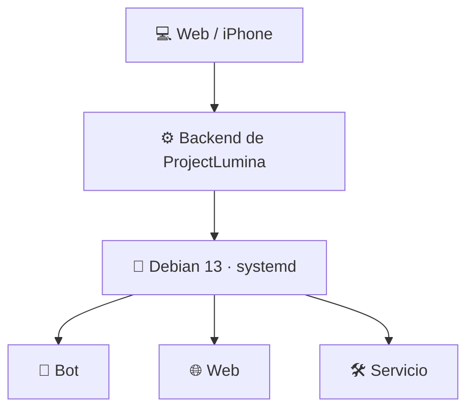
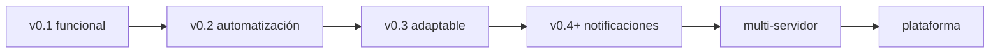

# 💡 ProjectLumina

> Centro de control remoto personal: administra tu servidor, bots y webs desde una interfaz web, sin ir físicamente a la máquina.

  

---

## 📖 Qué es

**ProjectLumina** administra un servidor (una laptop con **Debian 13**) desde el navegador, accesible desde tu laptop principal y tu **iPhone**.

Con Lumina podrás, sin entrar físicamente al servidor:

- 🤖 **Administrar bots**
- 🌐 **Administrar webs**
- 🔄 **Iniciar, detener y reiniciar servicios**
- 📊 **Consultar estados y métricas**
- 📜 **Ver logs desplegables**
- ⚡ **Ejecutar acciones remotamente**

---

## 📍 Estado actual

| Fase | Estado |
|------|--------|
| Planificación y documentación | ✅ Completa |
| Base del proyecto (FastAPI) | ✅ Funciona localmente |
| Dashboard web (maqueta) | ✅ Estados vacíos, sin datos falsos |
| Requisitos técnicos | ✅ Cerrados |
| Arquitectura definitiva del MVP | ✅ Cerrada |
| Desarrollo v0.1.0 | ⏳ Siguiente paso (requiere acceso al servidor) |

- Ver: [Estado actual](docs/estado-actual.md)

> La interfaz web ya es **una sola página** (vistas por hash, sin recargas) y la gestión real de bots/webs llegará en **v0.1** cuando se disponga de acceso al servidor.

---

## 🧱 Stack (definitivo)

| Área | Tecnología |
|------|------------|
| Backend | Python · **FastAPI** · Uvicorn |
| API | **REST + JSON** (documentada en `/docs`) |
| Base de datos | **SQLite** · SQLModel |
| Métricas | **psutil** |
| Servicios | **systemd** (`systemctl`) |
| Webs | Chequeo de disponibilidad por **HTTP** |
| Frontend | HTML · CSS · JavaScript vanilla |
| Seguridad MVP | **Token de API** (`LUMINA_TOKEN`) |
| Configuración | `pydantic-settings` (`LUMINA_*` en `.env`) |

→ Más en [Requisitos](docs/requisitos.md#requisitos-técnicos-definitivos)

---

## 🏗️ Arquitectura del MVP

Sin agente: `Web → Backend → Debian`.



El código se organiza en capas (`app/api` → `app/services` → `app/system`): solo la capa `system` toca el sistema operativo.

```text
Dashboard → app/api (routers + token) → app/services (negocio)
         → app/system (systemd + psutil) → Debian 13
```

→ [Arquitectura definitiva del MVP](docs/arquitectura.md#arquitectura-definitiva-del-mvp)

---

## 📁 Estructura del proyecto

```text
ProjectLumina/
├── app/          # backend en capas (api · services · system · models · config · db) → v0.1
├── web/          # frontend (templates · static)
├── data/         # SQLite (lumina.db)
├── logs/
├── pruebas/      # tests (pytest)
├── scripts/      # run.sh
├── docs/         # documentación
└── lumina.py     # base actual → se migra a app/ en v0.1
```

---

## 🚀 Inicio rápido

```bash
bash scripts/run.sh
```

Crea el entorno virtual (si no existe), instala las dependencias y arranca el servidor.

- **Web:** http://127.0.0.1:8000/
- **API de prueba:** http://127.0.0.1:8000/api/health → `{"status":"ok"}`
- **Documentación API (Swagger):** http://127.0.0.1:8000/docs

Ejecutar los tests:

```bash
.venv/bin/pytest pruebas/
```

---

## 📚 Documentación

| Área | Documento |
|------|-----------|
| 📖 Inicio | [Documentación general](docs/README.md) · [Estado actual](docs/estado-actual.md) |
| 🎯 Plan | [Requisitos](docs/requisitos.md) · [Arquitectura](docs/arquitectura.md) · [Roadmap](docs/roadmap.md) |
| 🛠️ Desarrollo | [Backend](docs/desarrollo/backend.md) · [API](docs/desarrollo/api.md) · [Base de datos](docs/desarrollo/base-de-datos.md) |
| 📊 Frontend | [Frontend](docs/desarrollo/frontend.md) · [Dashboard](docs/desarrollo/dashboard.md) |
| 🤖 🌐 Bots y webs | [Bots](docs/desarrollo/bots.md) · [Webs](docs/desarrollo/webs.md) |
| 🐧 Servidor | [Servidor](docs/desarrollo/servidor.md) · [Control remoto](docs/desarrollo/control-remoto.md) |
| 🔐 Seguridad | [Seguridad](docs/seguridad.md) |
| 🧠 Obsidian | [Mapa de notas](docs/obsidian/) |

---

## 🗺️ Roadmap



→ [Roadmap completo](docs/roadmap.md)

---

## 📜 Licencia

[MIT](LICENSE) — Copyright (c) 2026 netsent