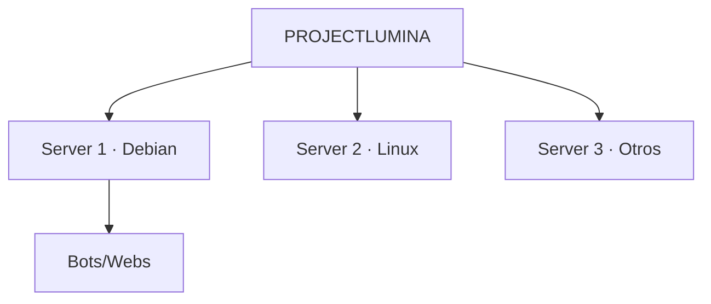
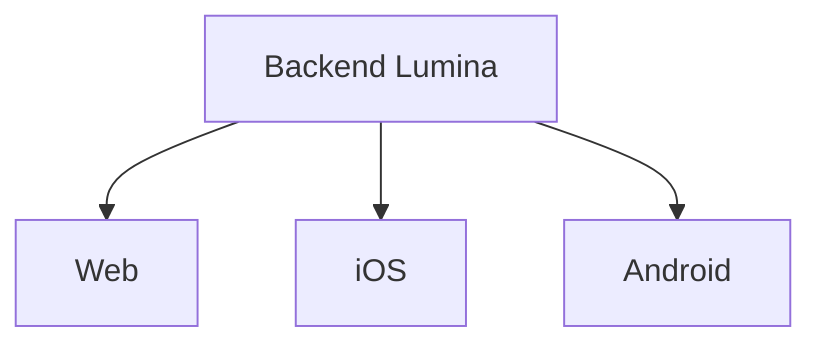

# 🧭 Visión — ProjectLumina

> Planificación general, visión y roadmap del proyecto.

---

## Identidad

| Campo | Valor |
|-------|-------|
| **Nombre** | ProjectLumina |
| **Estado** | Desarrollo v0.1 |
| **Versión inicial** | v0.1.0 |
| **Tipo** | Proyecto personal de programación, administración de servidores y redes |
| **Objetivo general** | Crear un panel para administrar los servicios, bots, webs y métricas de la máquina donde corre |

---

## Idea general

ProjectLumina es un **panel de administración** que gestiona **la máquina donde corre**: sistema operativo, servicios systemd, procesos, bots y webs.

La primera versión es una **aplicación web** que se abre en el navegador de esa misma máquina (accesible también por la red local). Desde ella se podrá:

- Consultar el estado de la máquina (CPU, RAM, uptime).
- Administrar bots.
- Administrar webs.
- Ejecutar acciones (iniciar, detener, reiniciar, logs) sin entrar por consola.

> La **administración remota** (acceso desde otro dispositivo, p. ej. el iPhone) queda como **fase posterior**: primero un producto funcional local, después exponerlo de forma segura.

### Infraestructura

- La laptop servidor utilizará **Debian 13**.
- La idea de *"Lumina como el OS"* significa que Lumina será la **capa permanente de administración** sobre Debian.
- **Debian seguirá siendo el sistema operativo real**; Lumina se ejecuta encima.

---

## Visión a largo plazo

ProjectLumina podría evolucionar hasta **administrar múltiples servidores**.

1. Primero destinado a mis propios servidores.
2. En un futuro lejano, tras perfeccionar el sistema, podría administrar servidores de otras personas o clientes.



> ⚠️ **Principio:** la escalabilidad futura es importante, pero **no debe complicar innecesariamente el MVP**.

---

## Filosofía del proyecto

ProjectLumina debe **crecer junto con mis capacidades**. No se intentará construir todo desde el principio.

```text
Idea → MVP sencillo → Funcionamiento estable → Mejoras → Automatización
→ Mayor seguridad → Mayor compatibilidad → Múltiples servidores
→ Aplicaciones móviles → Plataforma completa
```

Las funcionalidades podrán agregarse, modificarse o eliminarse según las necesidades y capacidades futuras.

---

## Plataformas

### Primera etapa
- Laptop principal.
- iPhone.

### Futuro
- Aplicación nativa para iPhone.
- Aplicación universal para Android y otros dispositivos.

**Intención:** las interfaces futuras utilizarán el mismo backend → [Arquitectura](../01%20-%20Planificacion/Arquitectura.md).



---

## Principios técnicos

Consulta [Principios Tecnicos](../01%20-%20Planificacion/Principios%20Tecnicos.md) para los principios de diseño.

---

## Relacionado

- [Objetivos](Objetivos.md) · ¿Qué buscamos lograr?
- [Definicion Final](Definicion%20Final.md) · Definición formal.
- [Roadmap](../01%20-%20Planificacion/Roadmap.md) · ¿Cómo lo logramos?
- [Estado Actual](Estado%20Actual.md) · ¿Dónde estamos?
- [Arquitectura](../01%20-%20Planificacion/Arquitectura.md) · ¿Cómo se estructura?
- [Inicio](Inicio.md)
