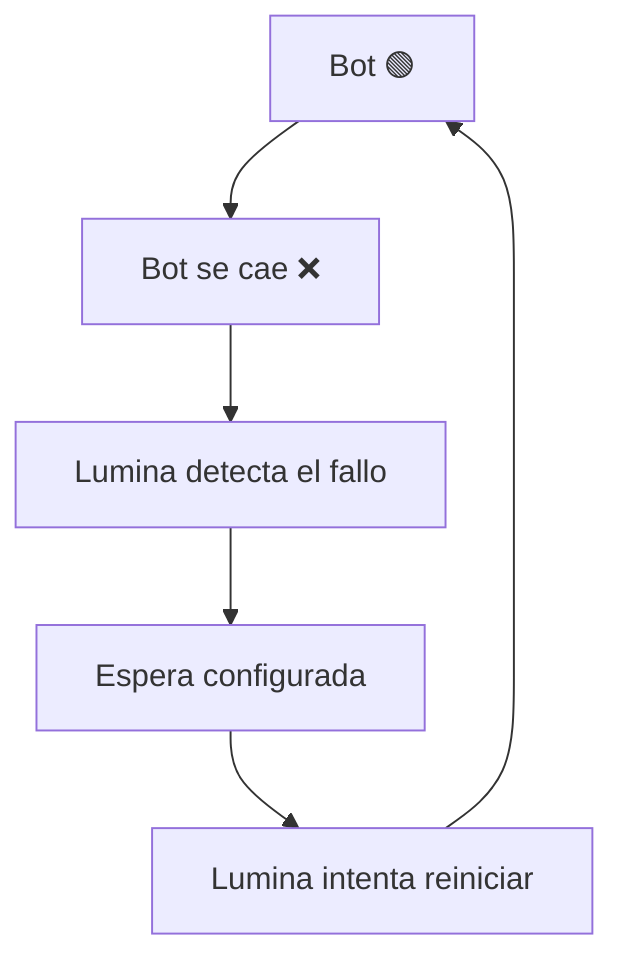

# 🔁 Auto Restart — ProjectLumina

> Detección de caídas y reinicio automático de bots.

---

## Concepto

ProjectLumina deberá poder **detectar cuándo un bot se cae** y tratar de **reiniciarlo automáticamente**.

---

## Flujo



---

## Configuración futura posible

```text
Auto-restart: Sí
Intentos máximos: 5
Espera entre intentos: 10 segundos
```

- **Intentos máximos** — Número de reintentos antes de rendirse.
- **Espera entre intentos** — Pausa entre reintentos.

---

## Estado

- Funcionalidad **importante confirmada** → [Requisitos](../01%20-%20Planificacion/Requisitos.md).
- Prevista para la versión **[v0.2](../05%20-%20Versiones/v0.2.md)**.

---

## Ejemplo de notificación asociada

Cuando se produce un reinicio automático → se puede notificar → [Notificaciones](Notificaciones.md).

```text
🚨 ProjectLumina
TelegramBot se cayó. Lumina intentó reiniciarlo. Estado: 🟢 Online
```

---

## Relacionado

- [Bots](Bots.md) · Objetos gestionados.
- [Acciones de Bots](Acciones%20de%20Bots.md) · Operaciones.
- [v0.2](../05%20-%20Versiones/v0.2.md) · Versión de implementación.
- [Notificaciones](Notificaciones.md) · Aviso de reinicios.
- [Inicio](../00%20-%20Inicio/Inicio.md)
