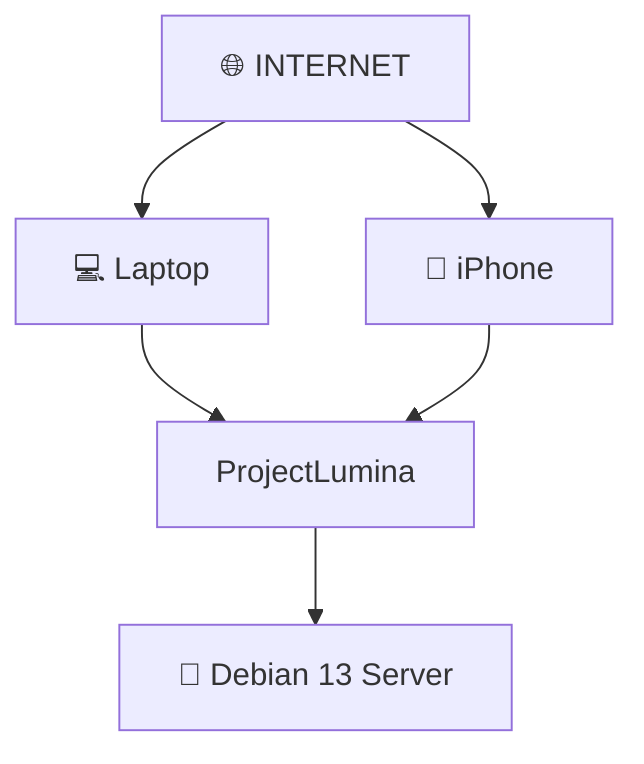

# 🌐 Acceso Remoto — ProjectLumina

> Acceso a ProjectLumina desde cualquier lugar del mundo.

---

## Objetivo

Uno de los objetivos es poder acceder a ProjectLumina desde **cualquier lugar del mundo mediante Internet**, no solamente desde la misma red local.

---

## Medidas de seguridad al exponer a Internet

Cuando se exponga a Internet deberán estudiarse y aplicarse correctamente:

- ✅ **HTTPS** — cifrado de la comunicación.
- ✅ **Autenticación** → [Autenticacion](Autenticacion.md).
- ✅ **Autorización** → [Permisos](Permisos.md).
- ✅ **Gestión de credenciales.**
- ✅ **Seguridad de APIs** → [API](../02%20-%20Desarrollo/API.md).
- ✅ **Firewall** → [Redes](../04%20-%20Investigacion/Redes.md).
- ✅ **NAT y redes** → [Redes](../04%20-%20Investigacion/Redes.md).
- ✅ **Control de acceso.**
- ✅ **Protección contra accesos no autorizados.**

---

## Operaciones sensibles

La **ejecución remota de comandos** es una capacidad sensible y debe protegerse correctamente → [Control Remoto](../02%20-%20Desarrollo/Control%20Remoto.md).

- Considerar **VPN/Túnel** como alternativa a exponer directamente el puerto → [Redes](../04%20-%20Investigacion/Redes.md).
- Seguir el principio de [Principios Tecnicos](../01%20-%20Planificacion/Principios%20Tecnicos.md).

---

## Relacionado

- [API](../02%20-%20Desarrollo/API.md) · Superficie expuesta.
- [Autenticacion](Autenticacion.md) · [Permisos](Permisos.md) · Protección.
- [Redes](../04%20-%20Investigacion/Redes.md) · NAT, firewall, VPN.
- [SSH](../04%20-%20Investigacion/SSH.md) · Acceso administrativo.
- [Control Remoto](../02%20-%20Desarrollo/Control%20Remoto.md) · Capacidad sensible.
- [Inicio](../00%20-%20Inicio/Inicio.md)
