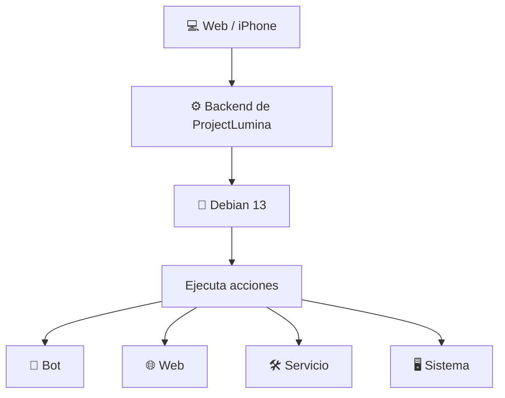
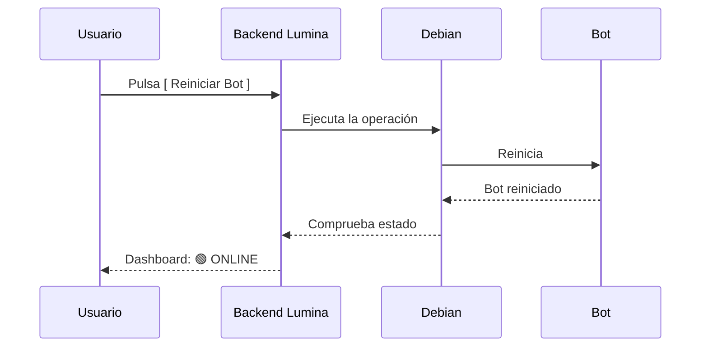
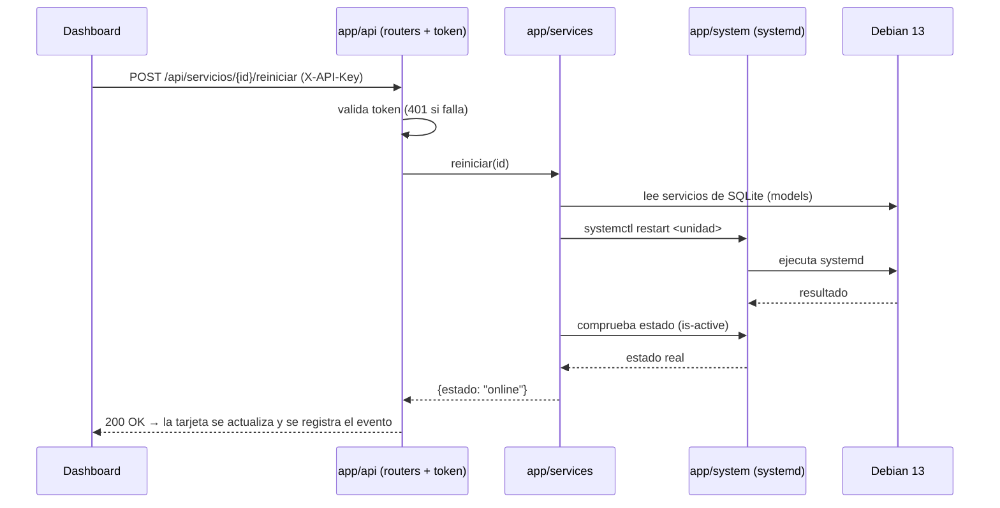
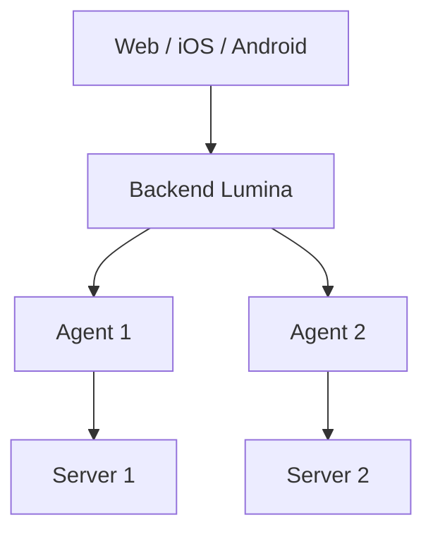
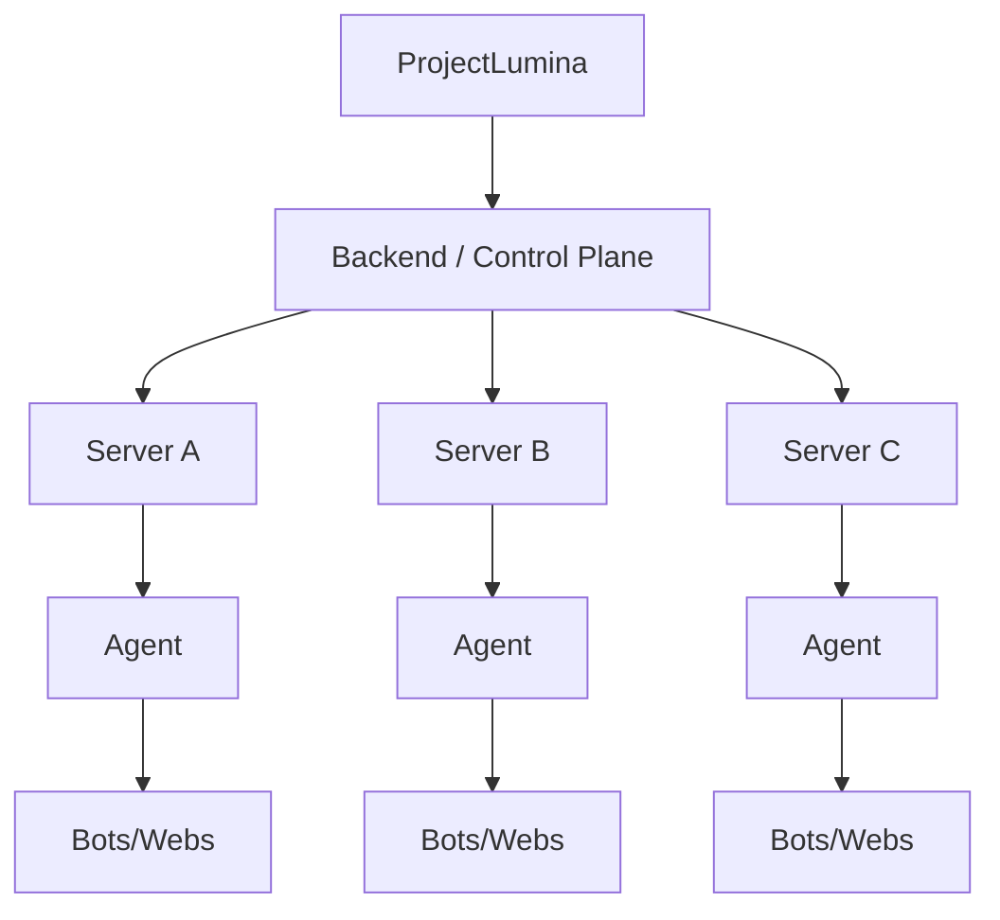

# Arquitectura — ProjectLumina

## Arquitectura del MVP

La arquitectura preferida para el MVP es **simple**: sin agente.



Forma simplificada: `Web → Backend Lumina → Debian`.

## Ejemplo de flujo



## Agente Lumina

Se consideró un agente independiente (`Web → Backend → Agente Lumina → Servidor`).

- **Para el MVP NO se utilizará agente.** Se mantiene arquitectura sencilla.
- El agente queda para una **etapa posterior**, especialmente al administrar **múltiples servidores**.

## Comunicación

- **Frontend ↔ Backend:** API REST. Ver [API](desarrollo/api.md).
- WebSockets podrán incorporarse posteriormente para datos en tiempo real.

---

## Arquitectura definitiva del MVP

> Decidida según los [requisitos técnicos](requisitos.md#requisitos-técnicos-definitivos). Registro → [decisiones](obsidian/06%20-%20Registro/Decisiones.md).

### Decisiones clave

- **Sin agente**: `Web → Backend → Debian` (REST por polling).
- **Stack**: FastAPI + SQLModel (SQLite) + psutil + systemd → ver [requisitos](requisitos.md#requisitos-técnicos-definitivos).
- **Regla de capas**: solo la capa `system/` toca el sistema operativo y solo la capa `api/` habla con el navegador.
- **`{id}` único**: bots y webs viven en una sola tabla `servicios` (campo `tipo`) → [base-de-datos](desarrollo/base-de-datos.md).

### Estructura definitiva del código

```
ProjectLumina/
│
├── app/                          # backend (migración de lumina.py en v0.1)
│   ├── __init__.py
│   ├── main.py                   # crea la app FastAPI y monta routers + estáticos
│   ├── config.py                 # configuración LUMINA_* (pydantic-settings)
│   ├── db.py                     # engine y sesión SQLite (SQLModel)
│   ├── api/                      # única capa que expone endpoints
│   │   ├── __init__.py
│   │   ├── auth.py               # dependencia del token (X-API-Key / Bearer)
│   │   ├── servicios.py          # /api/servicios*
│   │   └── servidor.py           # /api/servidor*
│   ├── services/                 # lógica de negocio (bots/webs, servidor)
│   │   ├── __init__.py
│   │   ├── servicios.py          # iniciar/detener/reiniciar/estado/logs
│   │   └── servidor.py           # métricas y procesos
│   ├── system/                   # única capa que toca el SO
│   │   ├── __init__.py
│   │   ├── systemd.py            # systemctl (start/stop/restart/is-active/journalctl)
│   │   └── metricas.py           # psutil (CPU/RAM/disco/red/procesos)
│   └── models/                   # esquemas SQLModel
│       ├── __init__.py
│       └── servicio.py           # tabla `servicios`
│
├── web/                          # frontend (una sola página, la maqueta actual)
│   ├── templates/index.html      # vistas resumen/servicios (+ registro/ajustes)
│   └── static/css · js · assets  # servir en /static
│
├── data/lumina.db                # SQLite (no se versiona)
├── logs/                         # logs (no se versiona)
├── pruebas/                      # tests (pytest)
├── scripts/run.sh                # arranque local
└── lumina.py                     # base actual → se migra a app/ en v0.1
```

> **Transición:** la base actual (`lumina.py`, archivo único) se migra a `app/` respetando lo que ya funciona: `/`, `/index.html`, `/servicios` (→ `/#/servicios`), `/static` y `/api/health`.

### Flujo de una acción (p. ej. reiniciar)



### Plano de despliegue (MVP)

- ProjectLumina corre como **servicio systemd** (`lumina.service`) ejecutando Uvicorn (`app.main:app`).
- Escucha en `127.0.0.1:8000`; si se expone a Internet → **HTTPS** (reverse proxy) y **token** `LUMINA_TOKEN` → [seguridad](seguridad.md).
- Los `systemctl` de las unidades de bots/webs se permiten con **sudo restringido** (visudo minimalista).
- `data/` y `logs/` con permisos restrictivos y excluidos de Git.

> La estructura de carpetas de `app/` corresponde a los módulos previstos en [backend](desarrollo/backend.md#posibles-módulos).

---

## Arquitectura futura

### Etapa intermedia


### Etapa avanzada (multi-servidor con agentes)


### Etapa de plataforma (control plane)


## Estructura del código

> Definitiva para v0.1 → [Arquitectura definitiva del MVP](#arquitectura-definitiva-del-mvp).

- **Backend** → `app/` (api, services, system, models, config, db).
- **Frontend** → `web/` (templates + static).
- **Datos** → `data/lumina.db` · **Logs** → `logs/` · **Tests** → `pruebas/`.
- **Base actual** → `lumina.py`, que se migra a `app/` en v0.1.

```text
ProjectLumina/
├── app/          # backend (api · services · system · models · config · db)
├── web/          # frontend (templates · static)
├── data/         # SQLite (lumina.db)
├── logs/
├── pruebas/      # tests
├── scripts/      # run.sh
├── docs/         # documentación
└── lumina.py     # base actual (→ app/ en v0.1)
```

> Según [Principios Técnicos](obsidian/01%20-%20Planificacion/Principios%20Tecnicos.md) no se fuerza `config/` ni `components/` en el MVP: se añaden solo si hacen falta.

---

Volver a [índice](README.md).
