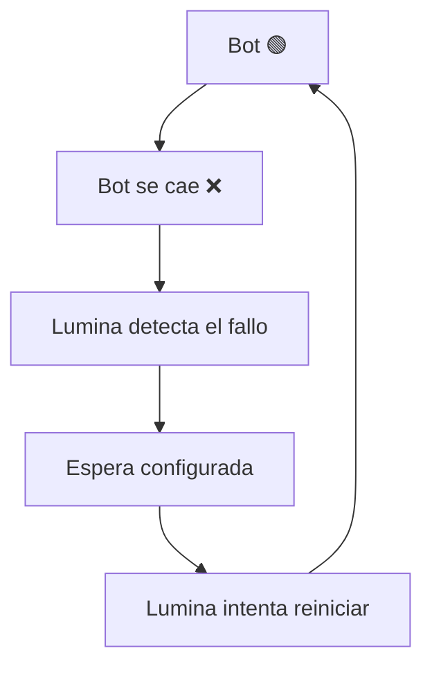

# Auto-restart — ProjectLumina

ProjectLumina deberá poder **detectar cuándo un bot se cae** y tratar de **reiniciarlo automáticamente**.

## Flujo



## Configuración futura posible

```
Auto-restart: Sí
Intentos máximos: 5
Espera entre intentos: 10 segundos
```

## Estado

- Funcionalidad **importante confirmada**.
- Prevista para la versión **v0.2** → [roadmap](../roadmap.md).

## Notificación asociada

Cuando se produce un reinicio automático puede notificarse → [notificaciones](notificaciones.md).

---

Volver a [desarrollo](README.md).
