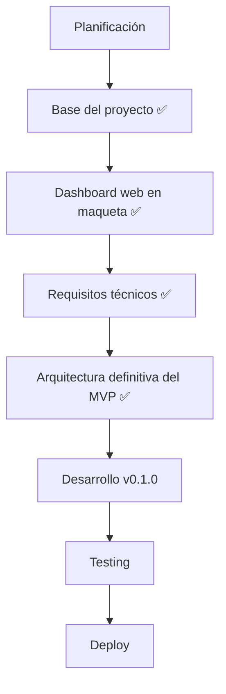

# 📍 Estado actual — ProjectLumina

> Situación del proyecto y siguiente camino.

---

## Fase actual

**Planificación técnica completada: requisitos y arquitectura del MVP cerrados.** 🟢

La etapa de planificación avanzó, la **base inicial** funciona localmente, el **dashboard web está en maqueta** (estados vacíos, sin datos falsos) y ya están **definidos los requisitos técnicos y la arquitectura definitiva del MVP**. Falta el acceso al servidor para iniciar el desarrollo de v0.1.

> Detalles en [implementación (obsidian)](../docs/obsidian/06%20-%20Registro/Implementacion.md)

---

## Siguiente camino

---

## Progreso por fases

> Marca `[x]` cuando completes cada hito.

| Fase | Estado |
|------|--------|
| Planificación | ✅ Documentación técnica completa |
| Base del proyecto | ✅ Backend mínimo con FastAPI, arranca y verifica conectividad |
| Dashboard web (maqueta) | ✅ Interfaz con estados vacíos y micro-animaciones (sin datos reales) |
| Requisitos técnicos | ✅ **Cerrados** (FastAPI, SQLite+SQLModel, psutil, systemd, token API) |
| Arquitectura definitiva MVP | ✅ **Cerrada** (capa `app/`, despliegue systemd) |
| Desarrollo v0.1.0 | ⏳ Siguiente paso (requiere acceso al servidor) |
| Testing | ⏳ Pendiente |
| Deploy | ⏳ Pendiente |

---

## Objetivo inmediato

> **Conseguir que ProjectLumina pueda administrar correctamente un bot y una web desde un dashboard web.**

A partir de ahí se construirá el resto del sistema.

---

## Siguientes acciones

1. ✅ Elegir backend → **FastAPI**.
2. ✅ Estructurar el repositorio y montar la base ejecutable.
3. ✅ Montar una maqueta del dashboard web (interfaz, estáticos servidos, micro-animaciones).
4. ✅ **Cerrar los requisitos técnicos** → [requisitos.md](requisitos.md#requisitos-técnicos-definitivos).
5. ✅ **Cerrar la arquitectura definitiva del MVP** → [arquitectura.md](arquitectura.md#arquitectura-definitiva-del-mvp).
6. (Cuando se recupere acceso al servidor) iniciar el **desarrollo de v0.1**: aplicar la estructura `app/` y gestionar bots/webs.

---

Volver a [índice](README.md).
