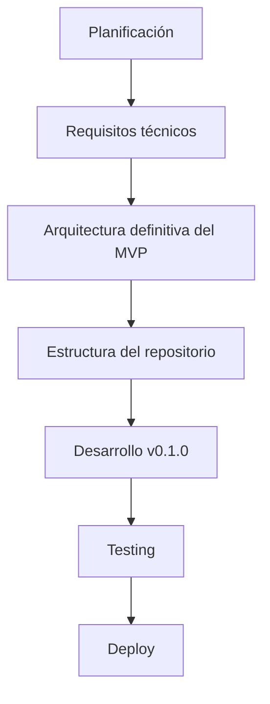

# 📍 Estado actual — ProjectLumina

> Situación del proyecto y siguiente camino.

---

## Fase actual

**Planificación.** 🟡

El proyecto se encuentra en la etapa de planificación, previa a la implementación.

---

## Siguiente camino

---

## Progreso por fases

> Marca `[x]` cuando completes cada hito.

| Fase | Estado |
|------|--------|
| Planificación | ✅ En curso (documentación generada) |
| Requisitos técnicos | ⏳ Pendiente |
| Arquitectura definitiva MVP | ⏳ Pendiente |
| Estructura del repositorio | ⏳ Pendiente |
| Desarrollo v0.1.0 | ⏳ Pendiente |
| Testing | ⏳ Pendiente |
| Deploy | ⏳ Pendiente |

---

## Objetivo inmediato

> **Conseguir que ProjectLumina pueda administrar correctamente un bot y una web desde un dashboard web.**

A partir de ahí se construirá el resto del sistema.

---

## Siguientes acciones

1. Definir los **requisitos técnicos** definitivos.
2. Elegir **Flask vs FastAPI**.
3. Fijar la **arquitectura definitiva del MVP**.
4. Estructurar el **repositorio**.
5. Iniciar el **desarrollo de v0.1**.

---

Volver a [índice](README.md).
