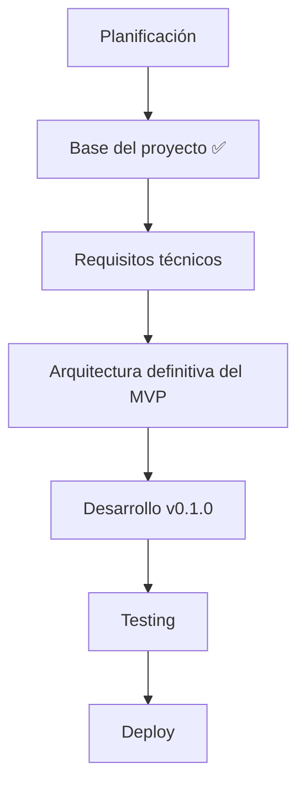

# 📍 Estado actual — ProjectLumina

> Situación del proyecto y siguiente camino.

---

## Fase actual

**Base del proyecto inicializada.** 🟢

La etapa de planificación avanzó y la **base inicial** ya está montada y funciona localmente (sin servidor). Se pasó de solo documentación a tener un backend mínimo ejecutable con **FastAPI**.

> Detalles en [implementación (obsidian)](../docs/obsidian/06%20-%20Registro/Implementacion.md)

---

## Siguiente camino

---

## Progreso por fases

> Marca `[x]` cuando completes cada hito.

| Fase | Estado |
|------|--------|
| Planificación | ✅ Documentación generada |
| Base del proyecto | ✅ Backend mínimo con FastAPI, arranca y verifica conectividad |
| Requisitos técnicos | ⏳ Pendiente |
| Arquitectura definitiva MVP | ⏳ Pendiente |
| Desarrollo v0.1.0 | ⏳ Pendiente (requiere acceso al servidor) |
| Testing | ⏳ Pendiente |
| Deploy | ⏳ Pendiente |

---

## Objetivo inmediato

> **Conseguir que ProjectLumina pueda administrar correctamente un bot y una web desde un dashboard web.**

A partir de ahí se construirá el resto del sistema.

---

## Siguientes acciones

1. ✅ Elegir backend → **FastAPI**.
2. ✅ Estructurar el repositorio y montar la base ejecutable.
3. Definir los **requisitos técnicos** definitivos.
4. Fijar la **arquitectura definitiva del MVP**.
5. (Cuando se recupere acceso al servidor) iniciar el **desarrollo de v0.1**: gestión de bots/webs.

---

Volver a [índice](README.md).
