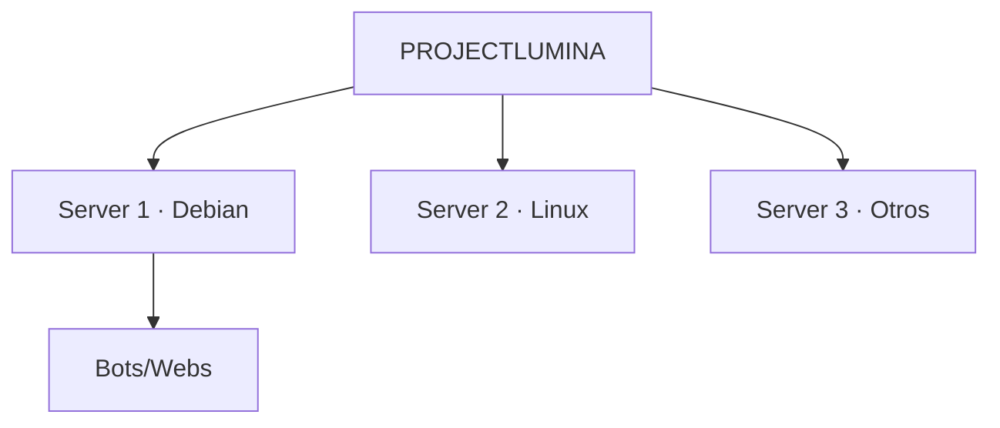
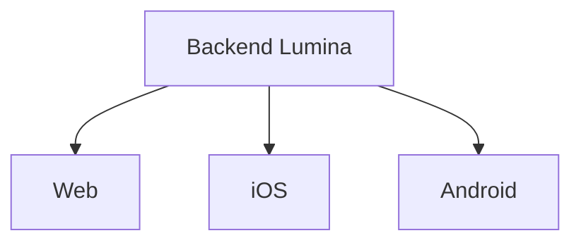

# 🧭 Visión — ProjectLumina

> Planificación general, visión y roadmap del proyecto.

---

## Identidad

| Campo | Valor |
|-------|-------|
| **Nombre** | ProjectLumina |
| **Estado** | Planificación |
| **Versión inicial** | v0.1.0 |
| **Tipo** | Proyecto personal de programación, administración de servidores y redes |
| **Objetivo general** | Crear un centro de control remoto para administrar servidores, bots, webs y servicios |

---

## Idea general

ProjectLumina será un **sistema de administración remota** para una laptop vieja utilizada como servidor.

La primera versión será una **aplicación web** accesible desde la laptop principal y desde un **iPhone**. Desde ella se podrá:

- Consultar el estado del servidor.
- Administrar bots.
- Administrar webs.
- Ejecutar acciones sin ir físicamente al servidor.

### Infraestructura

- La laptop servidor utilizará **Debian 13**.
- La idea de *"Lumina como el OS"* significa que Lumina será la **capa permanente de administración** sobre Debian.
- **Debian seguirá siendo el sistema operativo real**; Lumina se ejecuta encima.

---

## Visión a largo plazo

ProjectLumina podría evolucionar hasta **administrar múltiples servidores**.

1. Primero destinado a mis propios servidores.
2. En un futuro lejano, tras perfeccionar el sistema, podría administrar servidores de otras personas o clientes.



> ⚠️ **Principio:** la escalabilidad futura es importante, pero **no debe complicar innecesariamente el MVP**.

---

## Filosofía del proyecto

ProjectLumina debe **crecer junto con mis capacidades**. No se intentará construir todo desde el principio.

```text
Idea → MVP sencillo → Funcionamiento estable → Mejoras → Automatización
→ Mayor seguridad → Mayor compatibilidad → Múltiples servidores
→ Aplicaciones móviles → Plataforma completa
```

Las funcionalidades podrán agregarse, modificarse o eliminarse según las necesidades y capacidades futuras.

---

## Plataformas

### Primera etapa
- Laptop principal.
- iPhone.

### Futuro
- Aplicación nativa para iPhone.
- Aplicación universal para Android y otros dispositivos.

**Intención:** las interfaces futuras utilizarán el mismo backend → [[Arquitectura]].



---

## Principios técnicos

Consulta [[Principios Tecnicos]] para los principios de diseño.

---

## Relacionado

- [[Objetivos]] · ¿Qué buscamos lograr?
- [[Definicion Final]] · Definición formal.
- [[Roadmap]] · ¿Cómo lo logramos?
- [[Estado Actual]] · ¿Dónde estamos?
- [[Arquitectura]] · ¿Cómo se estructura?
- [Ver planificación completa](ProjectLumina_Planificacion)
