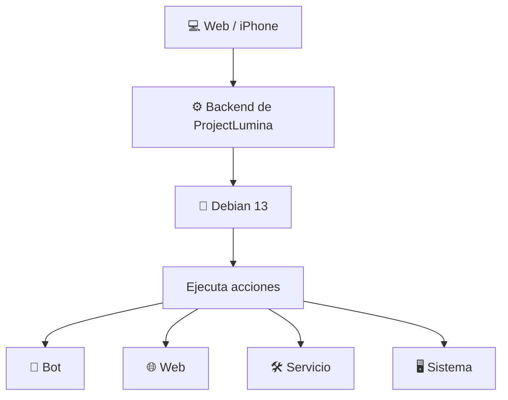
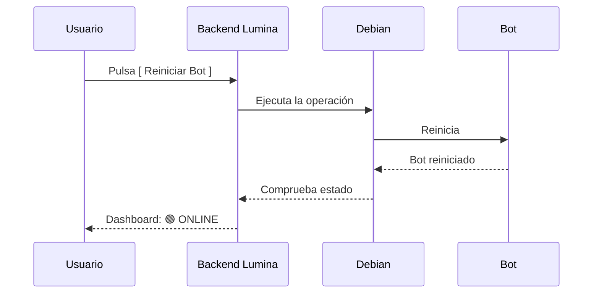
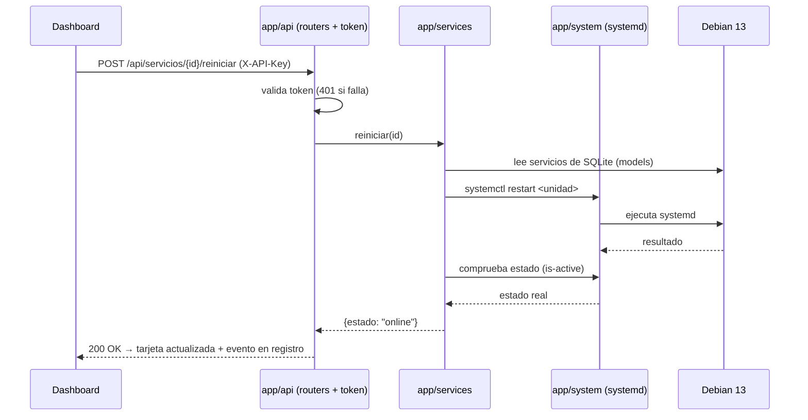
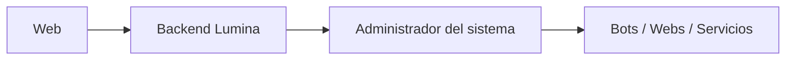
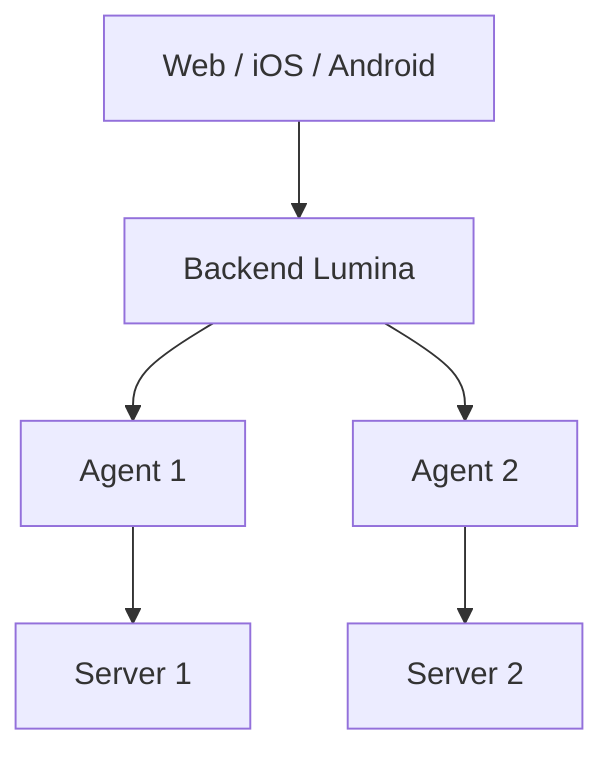
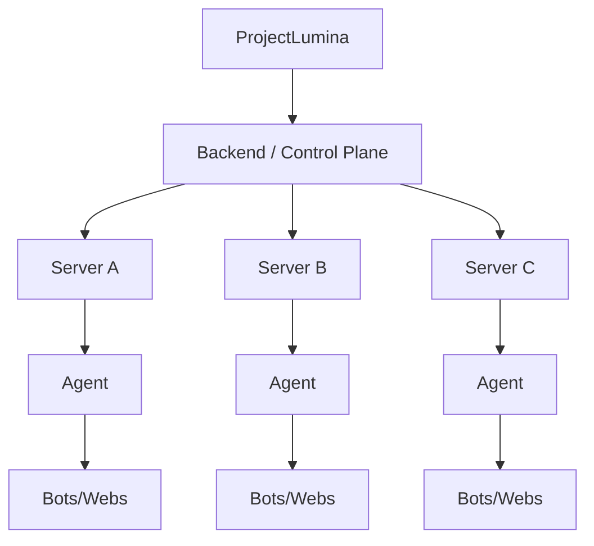

# 🏗️ Arquitectura — ProjectLumina

> Arquitectura del MVP y evolución hacia etapas futuras.

---

## Arquitectura del MVP

La arquitectura preferida para el MVP es **simple**: sin agente.



### Forma simplificada

```
Web → Backend Lumina → Debian
```

---

## Ejemplo de flujo



---

## Agente Lumina

Se consideró utilizar un agente independiente:

```text
Web → Backend → Agente Lumina → Servidor
```

- **Para el MVP NO se utilizará agente.** Se mantiene arquitectura sencilla.
- El agente queda para una **etapa posterior**, especialmente cuando se administren **múltiples servidores**.

→ Ver etapas futuras abajo.

---

## Comunicación

- **Frontend ↔ Backend:** API REST → [[API]].
- WebSockets podrán incorporarse posteriormente para datos en tiempo real.

---

## Arquitectura definitiva del MVP

> Decidida según los [[Requisitos#Requisitos técnicos (definitivos)]]. Registro → [[Decisiones]].

### Decisiones clave

- **Sin agente**: `Web → Backend → Debian` (REST por polling).
- **Stack**: FastAPI + SQLModel (SQLite) + psutil + systemd → [[Requisitos#Requisitos técnicos (definitivos)]].
- **Regla de capas**: solo `app/system/` toca el SO; solo `app/api/` habla con el navegador.
- **`{id}` único**: bots y webs en una sola tabla `servicios` (campo `tipo`) → [[Base de Datos]].

### Estructura definitiva del código

```text
ProjectLumina/
├── app/                          # backend (migración de lumina.py en v0.1)
│   ├── main.py                   # app FastAPI: routers + estáticos
│   ├── config.py                 # LUMINA_* (pydantic-settings)
│   ├── db.py                     # engine + sesión SQLite (SQLModel)
│   ├── api/                      # única capa que expone endpoints
│   │   ├── auth.py               # token (X-API-Key / Bearer)
│   │   ├── servicios.py          # /api/servicios*
│   │   └── servidor.py           # /api/servidor*
│   ├── services/                 # lógica de negocio
│   │   ├── servicios.py          # iniciar/detener/reiniciar/estado/logs
│   │   └── servidor.py           # métricas y procesos
│   ├── system/                   # única capa que toca el SO
│   │   ├── systemd.py            # systemctl + journalctl
│   │   └── metricas.py           # psutil
│   └── models/
│       └── servicio.py           # tabla `servicios`
├── web/                          # frontend (una sola página)
│   ├── templates/index.html
│   └── static/
├── data/lumina.db                # SQLite (no versionar)
├── logs/
├── pruebas/                      # tests
├── scripts/run.sh
└── lumina.py                     # base actual → app/ en v0.1
```

> **Transición:** la base actual se migra a `app/` respetando `/`, `/index.html`, `/servicios` (→ `/#/servicios`), `/static` y `/api/health`.

### Flujo de una acción (p. ej. reiniciar)



### Plano de despliegue (MVP)

- ProjectLumina corre como **servicio systemd** (`lumina.service`) con Uvicorn (`app.main:app`).
- Escucha en `127.0.0.1:8000`; si se expone → **HTTPS** (reverse proxy) y **token** `LUMINA_TOKEN` → [[Acceso Remoto]] · [[Seguridad]].
- `systemctl` de bots/webs con **sudo restringido** (visudo minimalista).
- `data/` y `logs/` con permisos restrictivos y fuera de Git → [[Git y GitHub]].

> La estructura de `app/` corresponde a los módulos de [[Backend#Posibles módulos en el código]].

---

## Arquitectura futura

### Etapa intermedia


### Etapa avanzada (multi-servidor con agentes)


### Etapa de plataforma (control plane)


---

## Estructura del código

> **Definitiva** para v0.1 → [[Arquitectura#Arquitectura definitiva del MVP|Arquitectura definitiva]].

```text
ProjectLumina/
├── app/          # backend (api · services · system · models · config · db)
│   ├── api/      → [[API]]
│   ├── services/ → [[Bots]] · [[Webs]]
│   ├── system/   → [[Servidor]] · [[Control Remoto]]
│   ├── models/   → [[Base de Datos]]
│   └── config/   → [[Configuracion de Bots]]
├── web/          # frontend (templates · static) → [[Frontend]]
├── data/         # SQLite (lumina.db) → [[Base de Datos]]
├── logs/         → [[Dashboard#Logs]]
├── pruebas/      # tests → [[Tareas#Testing]]
├── scripts/      # run.sh
├── docs/         # este mapa
└── lumina.py     # base actual → app/ en v0.1
```

> Según [[Principios Tecnicos#Simplicidad inicial]] no se fuerzan `components/` ni módulos extra en el MVP: se añaden solo si hacen falta.

---

## Relacionado

- [[Requisitos]] · Qué debe cumplir.
- [[Backend]] · Lógica del lado servidor.
- [[Frontend]] · Interfaz de usuario.
- [[API]] · Comunicación.
- [[Base de Datos]] · Almacenamiento.
- [[Servidor]] · Donde se ejecuta.
- [[Control Remoto]] · Ejecución de acciones.
- [Ver planificación completa](ProjectLumina_Planificacion)
