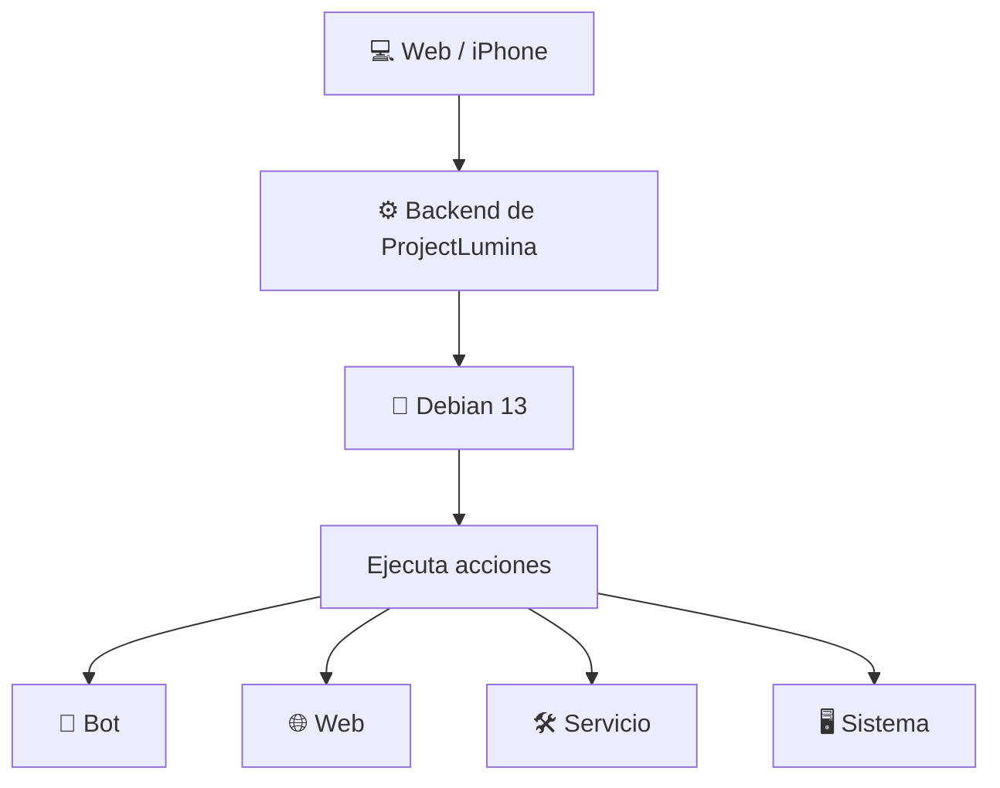
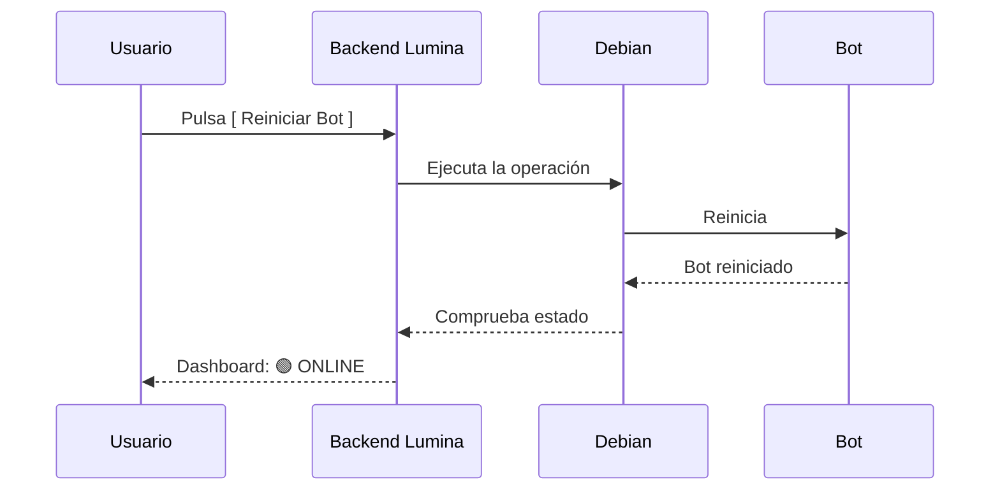
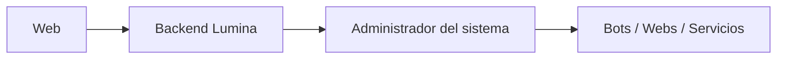
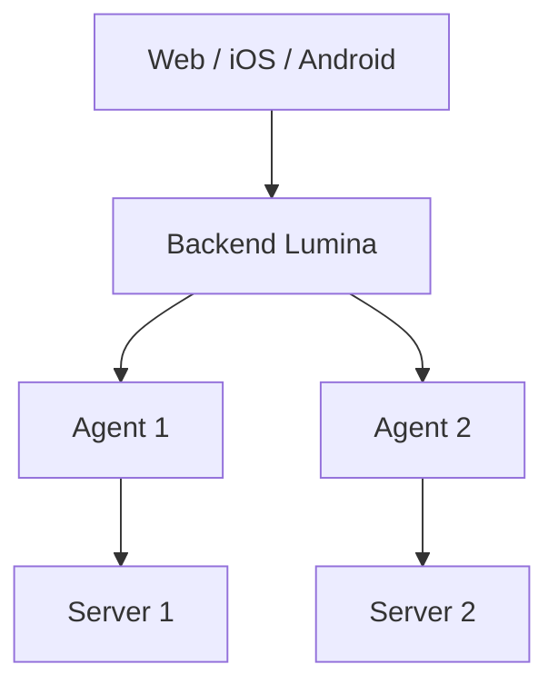
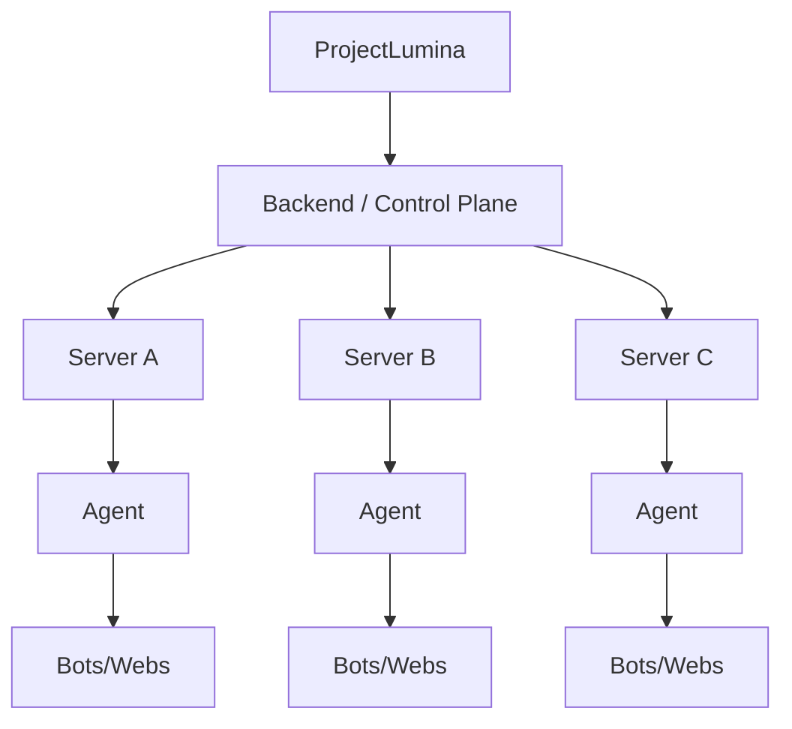

# 🏗️ Arquitectura — ProjectLumina

> Arquitectura del MVP y evolución hacia etapas futuras.

---

## Arquitectura del MVP

La arquitectura preferida para el MVP es **simple**: sin agente.



### Forma simplificada

```
Web → Backend Lumina → Debian
```

---

## Ejemplo de flujo



---

## Agente Lumina

Se consideró utilizar un agente independiente:

```text
Web → Backend → Agente Lumina → Servidor
```

- **Para el MVP NO se utilizará agente.** Se mantiene arquitectura sencilla.
- El agente queda para una **etapa posterior**, especialmente cuando se administren **múltiples servidores**.

→ Ver etapas futuras abajo.

---

## Comunicación

- **Frontend ↔ Backend:** API REST → [[API]].
- WebSockets podrán incorporarse posteriormente para datos en tiempo real.

---

## Arquitectura futura

### Etapa intermedia


### Etapa avanzada (multi-servidor con agentes)


### Etapa de plataforma (control plane)


---

## Estructura del código (propuesta)

```text
ProjectLumina/
│
├── README.md
├── .gitignore
├── requirements.txt
│
├── app/
│   ├── main.py
│   ├── api/          → [[API]]
│   ├── services/     → [[Bots]] · [[Webs]]
│   ├── models/       → [[Base de Datos]]
│   ├── system/       → [[Servidor]] · [[Control Remoto]]
│   └── config/       → [[Configuracion de Bots]]
│
├── web/
│   ├── templates/    → [[Frontend]]
│   ├── static/
│   │   ├── css/
│   │   └── js/
│   └── components/
│
├── data/
│   └── lumina.db     → [[Base de Datos]]
│
├── logs/             → [[Dashboard#Logs]]
│
├── tests/            → Ver [[Tareas#Testing]]
│
└── docs/             → Este mapa
```

> ⚠️ La estructura exacta podrá cambiar al implementar el proyecto.

---

## Relacionado

- [[Requisitos]] · Qué debe cumplir.
- [[Backend]] · Lógica del lado servidor.
- [[Frontend]] · Interfaz de usuario.
- [[API]] · Comunicación.
- [[Base de Datos]] · Almacenamiento.
- [[Servidor]] · Donde se ejecuta.
- [[Control Remoto]] · Ejecución de acciones.
- [Ver planificación completa](ProjectLumina_Planificacion)
