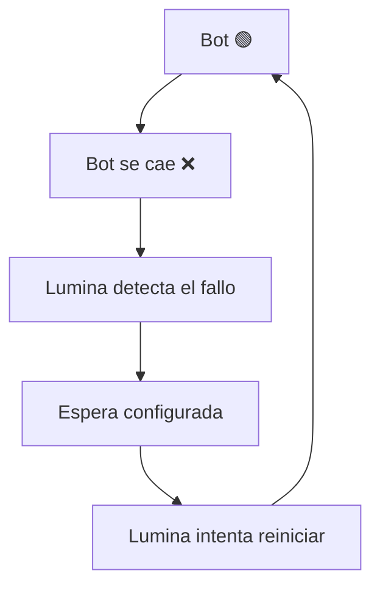

# 🔁 Auto Restart — ProjectLumina

> Detección de caídas y reinicio automático de bots.

---

## Concepto

ProjectLumina deberá poder **detectar cuándo un bot se cae** y tratar de **reiniciarlo automáticamente**.

---

## Flujo



---

## Configuración futura posible

```text
Auto-restart: Sí
Intentos máximos: 5
Espera entre intentos: 10 segundos
```

- **Intentos máximos** — Número de reintentos antes de rendirse.
- **Espera entre intentos** — Pausa entre reintentos.

---

## Estado

- Funcionalidad **importante confirmada** → [[Requisitos#MVP]].
- Prevista para la versión **[[v0.2]]**.

---

## Ejemplo de notificación asociada

Cuando se produce un reinicio automático → se puede notificar → [[Notificaciones]].

```text
🚨 ProjectLumina
TelegramBot se cayó. Lumina intentó reiniciarlo. Estado: 🟢 Online
```

---

## Relacionado

- [[Bots]] · Objetos gestionados.
- [[Acciones de Bots]] · Operaciones.
- [[v0.2]] · Versión de implementación.
- [[Notificaciones]] · Aviso de reinicios.
- [Ver planificación completa](ProjectLumina_Planificacion)
