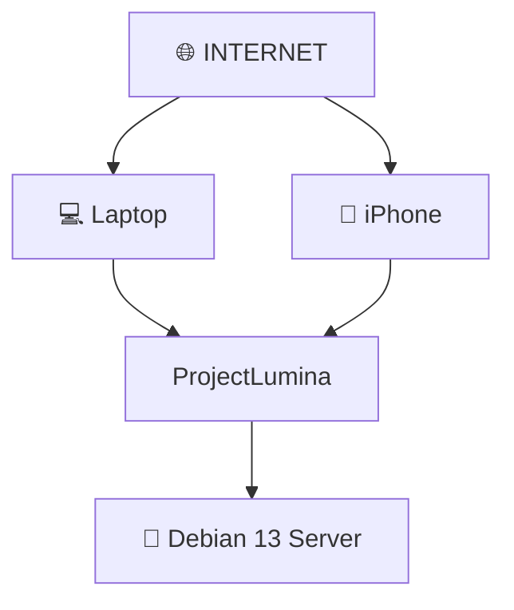

# 🌐 Acceso Remoto — ProjectLumina

> Acceso a ProjectLumina desde cualquier lugar del mundo.

---

## Objetivo

Uno de los objetivos es poder acceder a ProjectLumina desde **cualquier lugar del mundo mediante Internet**, no solamente desde la misma red local.

---

## Medidas de seguridad al exponer a Internet

Cuando se exponga a Internet deberán estudiarse y aplicarse correctamente:

- ✅ **HTTPS** — cifrado de la comunicación.
- ✅ **Autenticación** → [[Autenticacion]].
- ✅ **Autorización** → [[Permisos]].
- ✅ **Gestión de credenciales.**
- ✅ **Seguridad de APIs** → [[API]].
- ✅ **Firewall** → [[Redes]].
- ✅ **NAT y redes** → [[Redes]].
- ✅ **Control de acceso.**
- ✅ **Protección contra accesos no autorizados.**

---

## Operaciones sensibles

La **ejecución remota de comandos** es una capacidad sensible y debe protegerse correctamente → [[Control Remoto]].

- Considerar **VPN/Túnel** como alternativa a exponer directamente el puerto → [[Redes]].
- Seguir el principio de [[Principios Tecnicos#Seguridad]].

---

## Relacionado

- [[API]] · Superficie expuesta.
- [[Autenticacion]] · [[Permisos]] · Protección.
- [[Redes]] · NAT, firewall, VPN.
- [[SSH]] · Acceso administrativo.
- [[Control Remoto]] · Capacidad sensible.
- [Ver planificación completa](ProjectLumina_Planificacion)
