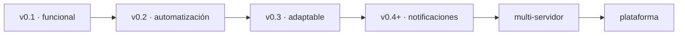

# Roadmap — ProjectLumina

> Hoja de ruta del proyecto por versiones y etapas.

## v0.1 — Base funcional

**Objetivo:** tener el primer centro de control funcionando.

- Backend.
- Frontend.
- API.
- Dashboard.
- Configuración de bots.
- Configuración de webs.
- Iniciar/detener/reiniciar.
- Estados.
- Logs.
- Métricas básicas.

## v0.2 — Automatización

**Objetivo:** que Lumina empiece a administrar por sí sola.

- Auto-start.
- Auto-restart.
- Detección de procesos caídos.
- Comprobación automática de webs.
- Reintentos.
- Configuración avanzada.
- Mejor manejo de servicios.

## v0.3 — Sistema adaptable

**Objetivo:** reducir la configuración manual.

- Detección de tipos.
- Detección de comandos.
- Detección de estructuras comunes.
- Adaptación de configuraciones.
- Plantillas genéricas cuando sean necesarias.

## v0.4+ — Notificaciones

**Objetivo:** informar al usuario de eventos importantes.

- Bot caído.
- Web caída.
- Reinicio automático.
- Error grave.
- Servidor fuera de línea.
- Alertas personalizadas.

## Etapas futuras

### Multi-servidor
Administrar múltiples servidores desde una sola instancia. Aquí podría incorporarse el concepto de **agente**.

### Plataforma (futuro lejano)
- Múltiples servidores y de terceros.
- Usuarios, roles y permisos avanzados.
- Aplicaciones iOS/Android.
- Backend externo.
- Sistema de agentes.
- Despliegues y automatizaciones avanzadas.

## Orden de desarrollo

---

Volver a [índice](README.md).
