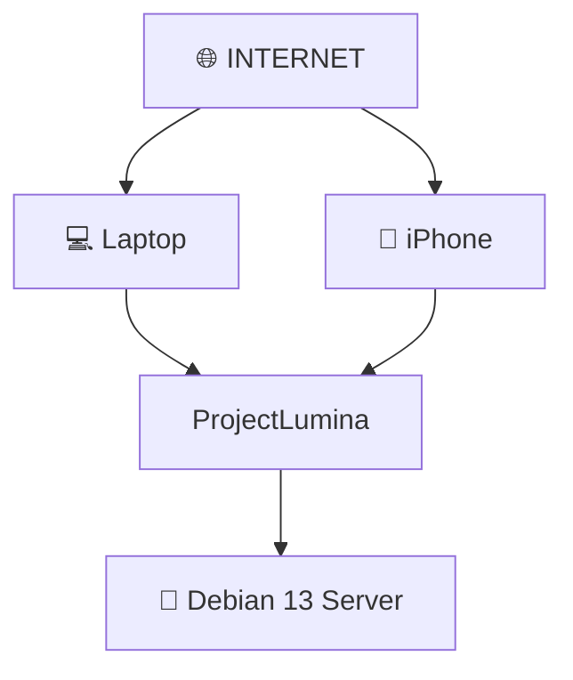

# Seguridad — ProjectLumina

## Principio rector

> Toda capacidad de **ejecución remota** debe tratarse como una **operación privilegiada**.

Ver también [arquitectura](arquitectura.md), [requisitos](requisitos.md) y [control remoto](desarrollo/control-remoto.md).

## Acceso remoto por Internet

Se podrá acceder a ProjectLumina desde cualquier lugar mediante Internet.



### Medidas de seguridad al exponer a Internet

- **HTTPS** — cifrado de la comunicación.
- **Autenticación** — identidad del usuario.
- **Autorización** — permisos.
- **Gestión de credenciales.**
- **Seguridad de APIs.**
- **Firewall.**
- **NAT y redes.**
- **Control de acceso.**
- **Protección contra accesos no autorizados.**

La **ejecución remota de comandos** es una capacidad sensible y debe protegerse correctamente.

## Autenticación y usuarios

### MVP
No habrá sistema de usuarios. ProjectLumina será una herramienta personal del propietario del servidor.

### Futuro
- Login.
- Autenticación.
- Usuarios.
- Roles.
- Permisos.
- Dispositivos autorizados.

Clave cuando el proyecto administre servidores de terceros.

## Permisos

Aunque no haya multiusuario inicialmente, las operaciones remotas son sensibles. Futuro: permisos configurables por servidor, dispositivo o usuario.

```
Servidor: Debian-01

Permisos:
✓ Ver métricas
✓ Ver procesos
✓ Reiniciar servicios
✓ Administrar bots
✓ Ejecutar comandos
✗ Modificar usuarios
✗ Apagar servidor
```

---

Volver a [índice](README.md).
