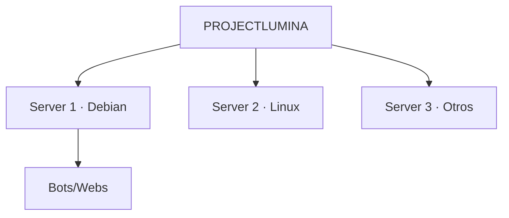
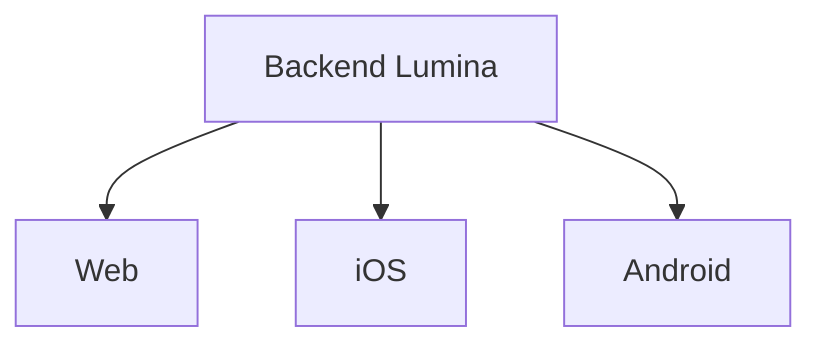

# Visión — ProjectLumina

## Identidad

| Campo | Valor |
|-------|-------|
| Nombre | ProjectLumina |
| Estado | Planificación |
| Versión inicial | v0.1.0 |
| Tipo | Proyecto personal de programación, administración de servidores y redes |
| Objetivo general | Crear un centro de control remoto para administrar servidores, bots, webs y servicios |

## Idea general

ProjectLumina será un **sistema de administración remota** para una laptop vieja utilizada como servidor.

La primera versión será una **aplicación web** accesible desde la laptop principal y desde un **iPhone**. Desde ella se podrá:

- Consultar el estado del servidor.
- Administrar bots.
- Administrar webs.
- Ejecutar acciones sin ir físicamente al servidor.

### Infraestructura

- La laptop servidor utilizará **Debian 13**.
- *"Lumina como el OS"*: Lumina será la capa permanente de administración sobre Debian.
- Debian seguirá siendo el **sistema operativo real**; Lumina se ejecuta encima.

## Visión a largo plazo

ProjectLumina podría evolucionar hasta **administrar múltiples servidores**.

1. Primero destinado a mis propios servidores.
2. En el futuro, tras perfeccionar el sistema, podría administrar servidores de otras personas o clientes.



> La escalabilidad futura es importante, pero **no debe complicar innecesariamente el MVP**.

## Filosofía

ProjectLumina debe **crecer junto con las capacidades**. No se intentará construir todo desde el principio.

```
Idea → MVP sencillo → Funcionamiento estable → Mejoras → Automatización
→ Mayor seguridad → Mayor compatibilidad → Múltiples servidores
→ Aplicaciones móviles → Plataforma completa
```

## Plataformas

| Etapa | Plataformas |
|-------|-------------|
| Primera | Laptop principal, iPhone |
| Futuro | App nativa iOS, app universal Android, otros |

La intención es que las interfaces futuras utilicen el **mismo backend**.



---

Volver a [índice](README.md).
